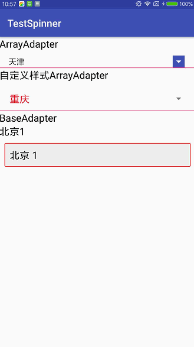

# TestSpinner
android控件——Spinner下拉框详解及使用

Spinner下拉框控件，这个控件其实在web端很常用，但是现在android端大多都是用popwindow、fragment或者dialog来实现了。
# Screenshots


# Spinner基本属性：
`android:spinnerMode=" "` 下拉框的样式 dropdown|dialog

`android:background=" "` 背景 设置这个之后 箭头会消失，如果想自定义样式，请设置background

`android:backgroundTint=" "` 右侧箭头的颜色

`android:backgroundTintMode=" "` 右侧箭头的样式

`android:overlapAnchor=" "` 这个很重要 默认true，使用时需要时设置成false，不然会遮盖spinner不是从下面弹出

`android:dropDownVerticalOffset=" "` 下拉框垂直位置

`android:dropDownHorizontalOffset=" "` 下拉框水平位置

# 使用：
xml中定义

```
<Spinner
        android:id="@+id/main_spinner_array"
        android:layout_width="match_parent"
        android:layout_height="wrap_content"
        android:layout_marginTop="10dp"
        android:layout_marginLeft="10dp"
        android:layout_marginRight="10dp"
        android:spinnerMode="dialog"
        android:backgroundTint="@color/colorPrimary"
        android:backgroundTintMode="add"
        android:overlapAnchor="false"
        />
```
activity中实现有两种，一种使用ArrayAdapter，另一种使用BaseAdapter

ArrayAdapter的数据和布局有局限性，只能是单个的TextView；BaseAdapter可自己定义bean，布局方面也可随意改变

如果想要自定义箭头，像下面这种


让美工切一张这个图，然后自己弄成.9格式就可以了。
